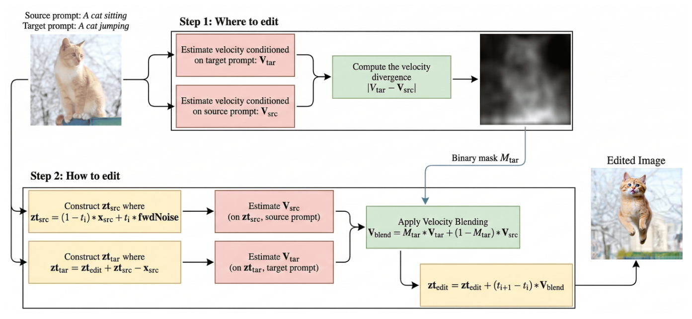

# FocusFlow: Localized Image Editing via Masked Velocity Blending

FocusFlow is an image editing method built on **Stable Diffusion 3 (SD3)** that enables precise, localized edits guided entirely by text prompts — no manual masks required. It extends [FlowEdit](https://github.com/fallenshock/FlowEdit) by combining automatic mask generation (inspired by DiffEdit) with velocity field blending to restrict edits to semantically relevant regions.

---

## Pipeline Overview



The pipeline takes a source image and two prompts (source and target), automatically identifies the regions to edit, and produces a semantically consistent output image.

---

## Methods Implemented

Three image editing methods are implemented and compared:

| Method        | Description                                                              |
| ------------- | ------------------------------------------------------------------------ |
| **FocusFlow** | Automatic mask generation + masked velocity blending (main contribution) |
| **FlowEdit**  | Delta velocity blending without masking (baseline)                       |
| **SDEdit**    | Noise-and-denoise with target prompt only (baseline)                     |

---

## How FocusFlow Works

### Phase 1 — Automatic Mask Generation

FocusFlow computes a soft spatial mask by sampling multiple noisy trajectories and measuring where the model predicts different velocity fields for the source vs. target prompt:

1. Sample 10 noisy latent trajectories at an intermediate noise level
2. Compute velocity differences: `ΔV = V_target − V_source`
3. Accumulate differences across samples to localize edit regions
4. Normalize via percentile clipping (1–99%) and smooth edges with blur and optional dilation

### Phase 2 — Masked Velocity Blending

The editing is performed by blending source and target velocity fields according to the mask:

```
V_blend = M · V_target + (1 − M) · V_source
```

- **ODE phase** (timesteps `T − n_max` to `T − n_min`): Euler integration with blended velocities
- **Sampling phase** (final `n_min` steps): Transition to standard sampling, with blending maintained

This ensures edits are confined to the masked region while preserving the rest of the image.

---

## Evaluation

The evaluation ran **40 test cases** spanning diverse edit types:

- Pose/action changes (e.g., cat sitting → tiger)
- Background replacement (e.g., dog in snow → dog in flowers)
- Material/style changes (e.g., cat → Lego cat, bronze sculpture)
- Multi-object selective edits

### Metrics

- **CLIP-T**: CLIP similarity between output image and target prompt (higher = better semantic alignment)
- **LPIPS**: Perceptual distance from source image (lower = better structure preservation)

### Aggregated Results

| Method        | CLIP-T ↑  | LPIPS ↓   |
| ------------- | --------- | --------- |
| **FocusFlow** | **0.296** | 0.289     |
| FlowEdit      | 0.241     | **0.196** |
| SDEdit        | 0.218     | 0.466     |

**FocusFlow achieves the highest semantic alignment** with target descriptions (CLIP-T), demonstrating effective localized editing. FlowEdit preserves source structure best (LPIPS), as it applies global edits conservatively. SDEdit shows the most distortion from source.

---

## Dependencies

- Python 3.10+
- PyTorch 2.x with CUDA
- `diffusers` (SD3 pipeline)
- `transformers` (CLIP)
- `lpips`
- `Pillow`, `NumPy`, `PyYAML`
